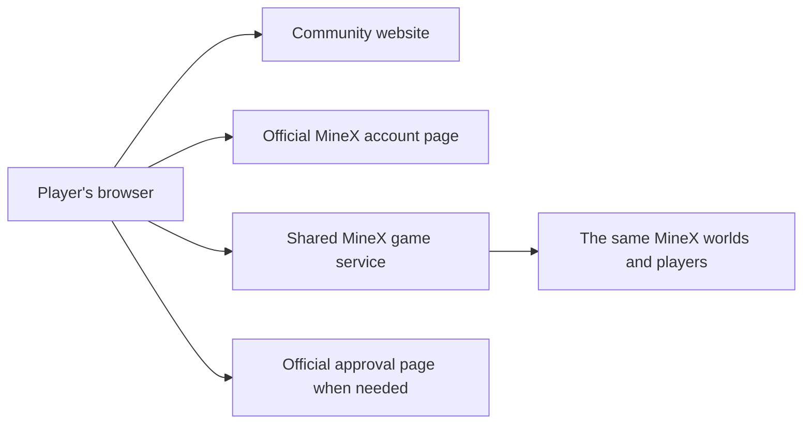

# MineX Community Web

**Host a community entry point. Play together on MineX.**

[Español](README.es.md) · [Pilot access](docs/pilot.md) · [Roadmap](docs/roadmap.md) · [VPS testing](docs/vps-test-plan.md)

MineX Community Web is a project to let communities host a web client on their own domain while their players join the same MineX worlds, use their existing MineX account, and play alongside other MineX players.

The community hosts the web experience. MineX continues to operate the shared game servers, accounts, and sensitive services.

> **Current stage: public planning and a local installation preview.**
> Community gameplay access is not available in this release. The first connected pilot will require manual approval from MineX. This repository does not yet contain the playable client or an installer for connected gameplay.

## One MineX, many community websites

A community should be able to share its own web address, welcome its players, and bring them into MineX without operating a separate game world.

The intended experience:

1. A player visits the community website.
2. They select **Continue with MineX**.
3. They sign in on an official MineX account page and return to the community website.
4. Their browser connects to the shared MineX service.
5. They play with the same community of players and retain their MineX identity and progress.

When a sensitive operation needs approval, the player reviews it on an official MineX approval page. The community website does not receive permission to approve it on their behalf.

These steps describe the target experience; the connected flow is still being built and verified.



## What is available today?

| Component | Status |
| --- | --- |
| Public architecture and implementation roadmap | Available here |
| Manual pilot application template | Available here; interest requests do not grant access |
| Local website installation preview | Available; no account, game, or payment connection |
| Public-content checks and preview tests | Available; run locally or in GitHub Actions |
| Community login and game admission | Planned; requires central implementation and testing |
| Playable client distribution | Pending a separate artifact and dependency review |
| Connected VPS installer | Planned |
| Automatic operator onboarding | Future phase, after the manually approved pilot |

## Try the installation preview

No VPS purchase, MineX account, API key, or wallet is needed for this step.
Download this repository, open a terminal in its folder, and use Python 3.10 or later:

```bash
python3 tools/check_public.py
python3 -m unittest discover -s tests -v
python3 tools/preview.py --port 8787
```

Open **http://127.0.0.1:8787** in your browser. Stop the process with `Ctrl+C`.

The page is an installation preview with no sign-in form and no game engine. A successful preview verifies that the small web service runs; it does not verify that a community can connect to MineX.

For a machine reached over SSH, see the [VPS test plan](docs/vps-test-plan.md). It starts with a private tunnel, then defines the separate work needed for a connected pilot.

## Join the first pilot

The first operators will be admitted manually, in small groups.

After this repository is published, open an issue using **Community pilot request**. Share a public community name, region, expected group size, and an optional public domain. A VPS is not required to express interest.

A maintainer reviews the request. When the connected pilot is ready, MineX will verify the domain, assign an installation identity and limits, and activate access through its central service.

**A GitHub issue, label, fork, or local configuration file is not an access credential.** Closing or approving an issue will not automatically enable a server.

Approval applies to connecting an installation to MineX. Reading the repository and running the local preview do not need approval.

See [pilot access and lifecycle](docs/pilot.md).

## What an operator hosts

| Community operator | MineX |
| --- | --- |
| Community domain and web hosting | Shared worlds and game admission |
| Launcher interface and, in a later release, reviewed client artifacts | Accounts, characters, permissions, and progress |
| Public installation configuration | Official sign-in and sensitive approvals |
| Their website's availability | Private wallet services and financial authorization |

The future package is intended to connect to the existing MineX service. It does not include the private components needed to run an independent copy of MineX.

MineX's existing Solana integration remains behind official services. This repository currently provides no wallet implementation, transaction execution service, or authority over player funds.

## Hosting can be distributed; accounts remain central

Community websites can run on different providers and in different countries. MineX still operates the shared accounts, worlds, and authorization services.

That means community hosting with central MineX services. It is not a promise that the whole game is decentralized.

In a later phase, the official playable website could be retired while official account, approval, and connection services remain available. That transition is planned, not scheduled or implemented here.

## Trust and player approval

A community controls the files it serves and can modify its frontend. The design must remain safe under that assumption.

- Player sign-in happens on an official account origin.
- Access to a game session does not confer financial approval rights.
- Sensitive approval uses canonical operation details from MineX.
- An IP address, website name, or client-declared status is not proof of authorization.
- MineX can suspend a community installation's access without deleting the players' accounts.
- Compiled or obfuscated client files do not replace these server-side rules.

These are acceptance requirements for connected releases, not a claim that the local preview implements them. Read the [architecture](docs/architecture.md) and [testing boundaries](docs/testing.md).

## Build with us

Useful early contributions include documentation, translations, accessibility feedback, installation testing, and clear reports about the local preview.

Start with [CONTRIBUTING.md](CONTRIBUTING.md). Maintainers review changes before release. Operator requests and code contributions use separate review processes.

This repository does not ask for SSH keys, passwords, OTPs, API credentials, or wallet recovery information. See [SECURITY.md](SECURITY.md) for private reporting.

## Repository guide

- [Architecture](docs/architecture.md): boundaries and target browser flow.
- [Pilot access](docs/pilot.md): manual review, activation, limits, and suspension.
- [Roadmap](docs/roadmap.md): stages and evidence needed to advance.
- [VPS test plan](docs/vps-test-plan.md): local preview, external test machine, connected rehearsal.
- [Testing](docs/testing.md): what the included checks establish.
- [Maintainer setup](docs/maintainer-setup.md): publication and repository settings.

## License

The original documentation, preview, and tools in this repository are available under the [MIT License](LICENSE).

This license covers the files published here. It does not grant rights to the MineX name or branding, access to MineX services, private server software, or third-party game code and assets. Any future client distribution will document the applicable components and licenses separately.
